# Architecture-Android

# 功能介绍

- 支持**配置变更**后的还原
  - **屏幕旋转**
  - **亮暗主题**切换
  - **语言**切换（国际化）
  - **字体大小**更改
  - **分屏**
  - **...**
- 支持**进程杀死**后的还原
- 项目架构：**模块化+组件化+MVI（UiState+ViewModel+Flow+Kotlin协程+Repository+DataSource+Retrofit）**
- 支持**多App开发**
- 支持一键**切换Feature模块单独运行**
- 支持一键**去除可移除功能代码**
- 支持项目**无反射**实现（项目**默认无反射**实现，**反射**实现也提供，可供在两者选择）
- 支持**EdgeToEdge**（**targetSdk>=35(Android15)**，**强制**开启了，所以为了**targetSdk>=35时兼任低版本**，需要**全部支持EdgeToEdge**）
- 支持**动态主题**（**Android12+支持此功能**）
- 支持**刷新、自动预加载**（自动预加载，如果**用户滑动慢并且获取数据快**，用户是**感觉不到加载的**）


本项目为一个**Android架构**，它遵循 **Android 设计**和**开发最佳实践**，旨在为开发者**提供实用参考**。

本项目**目标**是为了**同时**支持`Compose`和`View`，以支持**公司项目**目前已有的`View`代码和之后的`Compose`代码，目前本项目**仅**支持`View`，项目**Star**高后续会支持`Compose`。

本项目是以**字节跳动**公司的**抖音**App为参照，模拟开发的**抖音**App。由于本项目，**无抖音真正的网络数据**，所以本项目使用的数据，是通过某些**开源API**网络接口，**模拟**转的**网络数据**。


本项目是在**官方的架构**（[nowinandroid（18.2k Star）](https://github.com/android/nowinandroid)、[architecture-samples（44.9k Star）](https://github.com/android/architecture-samples)）上做的**升级和修改**，如果大家对**此架构模块的划分**不理解，建议大家先了解**官方的**[nowinandroid](https://github.com/android/nowinandroid)，然后再来看本项目。

本项目文档分为**快速介绍**、**详细介绍**（**模块间架构**、**模块内架构**）、**使用**，**建议大家按照顺序阅读文档**。如果**想快速**的查看代码，我提供了**demo工程**，里面有**最简单**的**使用案例**，请先阅读**此代码**。

欢迎大家一起来**维护**项目，使其功能更加的**强大**、**健硕**。有问题，有需求，请提[issue](https://github.com/zrq1060/architecture-android/issues/new)，或者私信我。

**欢迎大家点赞、收藏，以方便您后续查看。**


## 下载

[Apk下载](https://github.com/zrq1060/architecture-android/blob/master/docs/images/apk/app-release.apk)

**扫码下载**


## 截图

### App展示


| 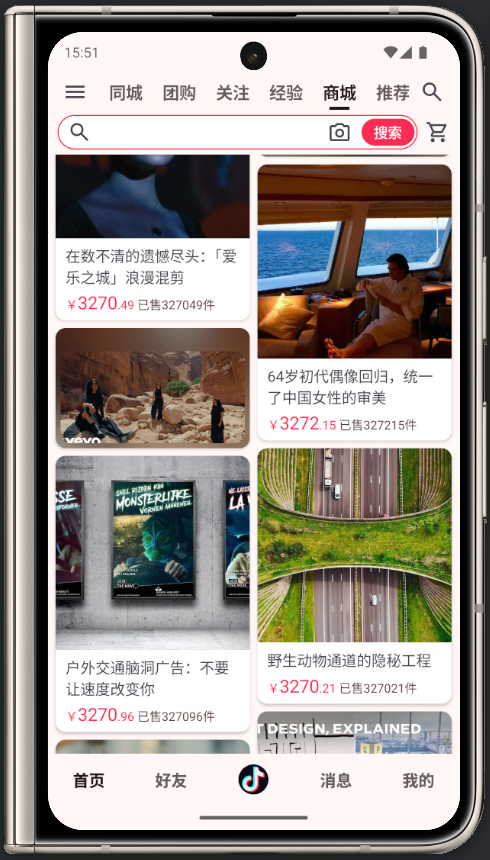 |  |  |
| ------------------------------------------------------ | ------------------------------------------------------ | ------------------------------------------------------ |

### 主题展示


|    Themes    |                                Light                                |                                Dark                                |
| :-----------: | :------------------------------------------------------------------: | :----------------------------------------------------------------: |
| **抖音主题** |   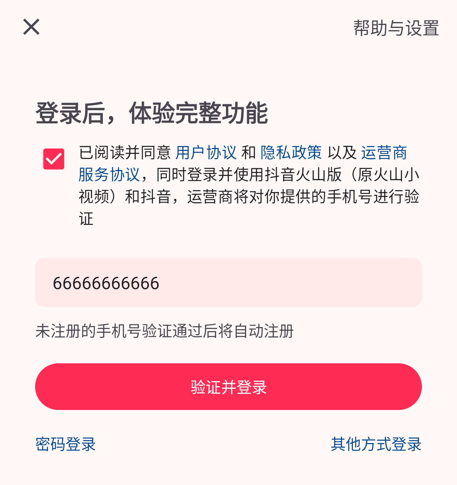   |   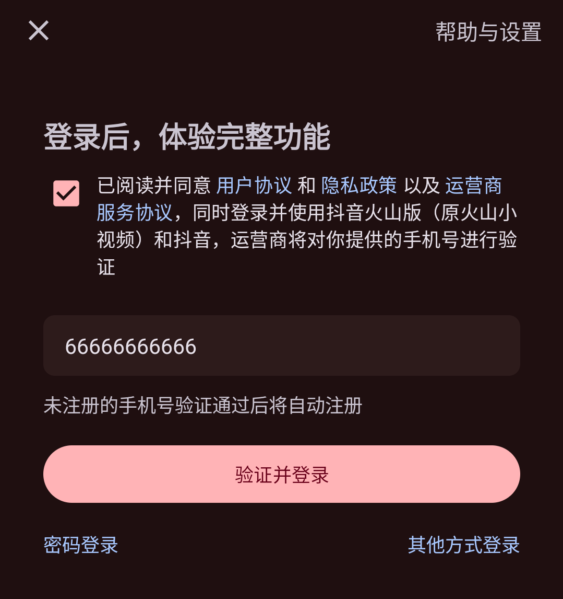   |
| **动态主题1** | 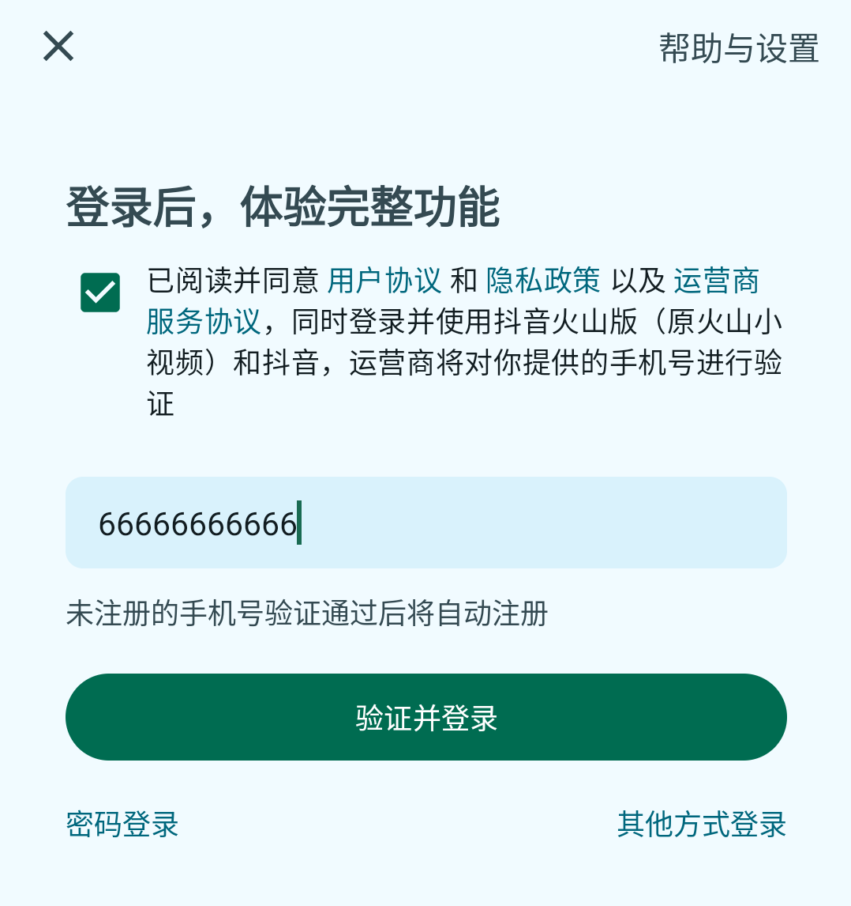 | 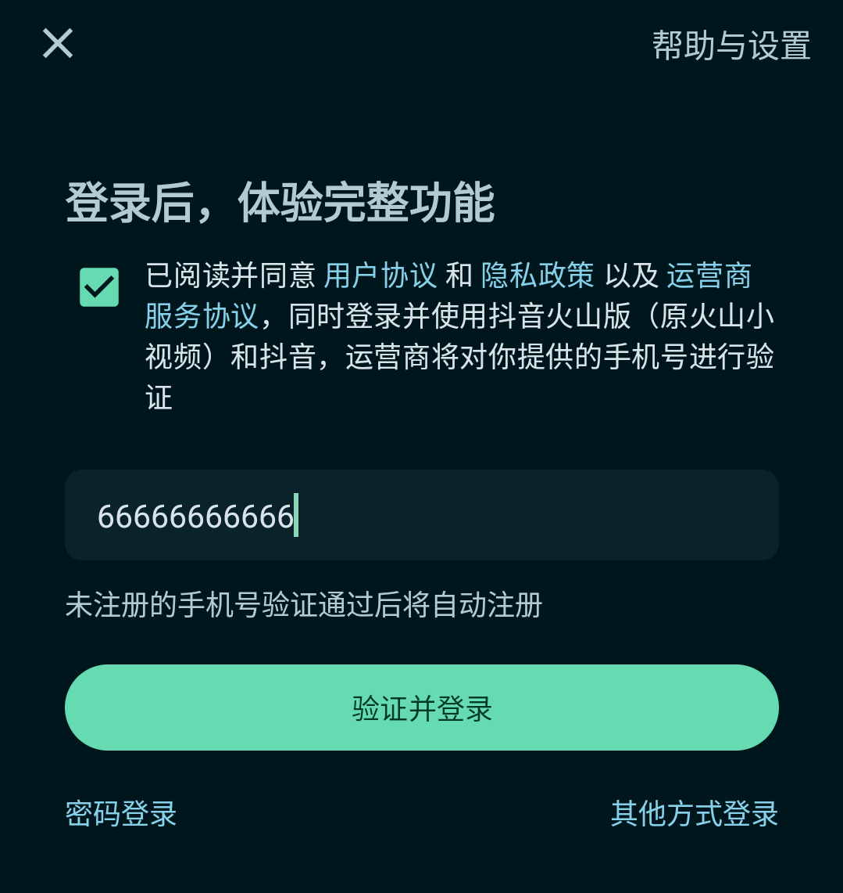 |
| **动态主题2** | 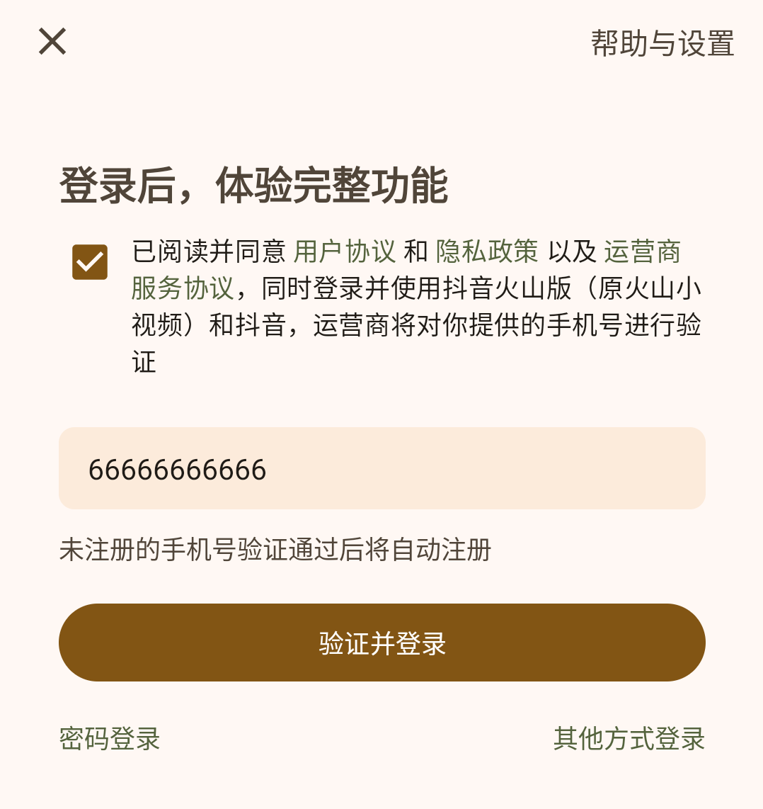 | 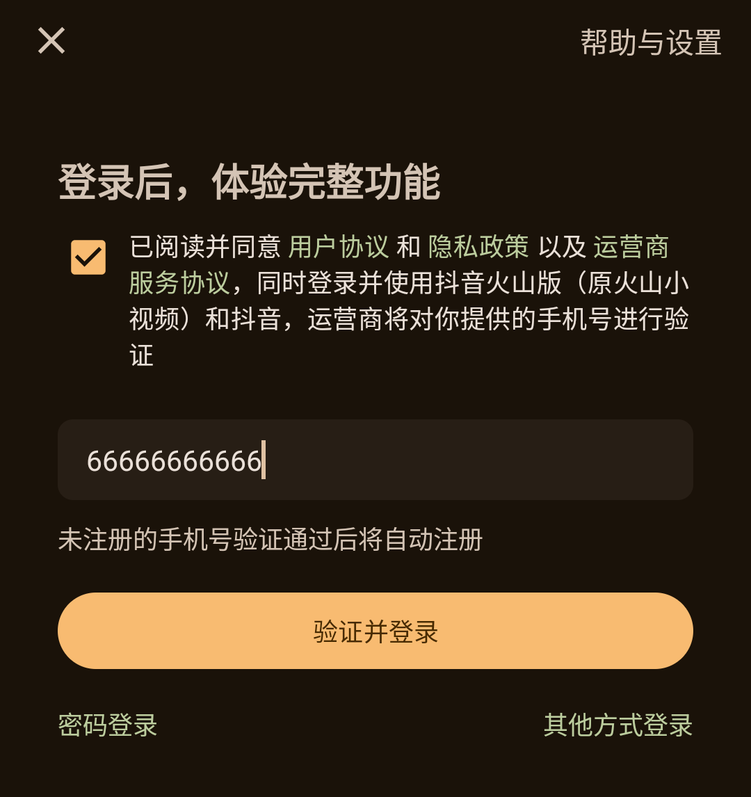 |

# 快速介绍

## 下载

**下载项目并运行**

```
git clone git@github.com:zrq1060/architecture-android.git
```

## 功能演示

> 本项目**任何**页面，都支持如下：
>
> - **配置变更后的还原**（**屏幕旋转**、**亮暗模式切换**、**语言切换**、**字体大小更改**、**分屏**等），配置变更会导致`Activity`、`Fragment`会**重新创建新的**。
>- **进程被杀死后的还原**（可打开，开发者选项-后台进程限制-不允许后台进程，以更好的测试进程被杀死。开启后，可在后台多打开一些无关的app，再切换打开此app即可演示此效果）。


本项目，目前**仅支持**如下功能：

- **登录页**：登录账号（手机号、邮箱）为**【任意】**，登录密码（验证码、密码）为**【123456】**。**可断网**，或输入**错误密码**，查看页面效果。

- **Home首页**：顶部栏目的排序（**长按首页-顶部栏目**）

- **Main主页**：好友、商场栏目的切换（**长按主页-底部栏目第2个**）

- **Shop商城页**：支持**刷新**、**自动加载**，**点击商城条目**模拟的商城列表数据的**增、删、改**操作。**可断网**，查看页面效果。

  

**在此跟着上面，操作App支持的功能（记得开启屏幕自动旋转、切换亮暗模式、点击商城Item），以演示上面功能效果。**


## 单独运行Feature模块演示

1、修改**项目根目录**下`gradle.properties`内`isFeatureSingle`为`true`，并`Sync`同步`Gradle`。

```groovy
isFeatureSingle = true
```

2、执行**安装全部命令**

点击右侧`Gradle`-`Tasks`-`install`-`installDebug`，**或**执行如下命令：

```groovy
.\gradlew installDebug
```

执行完后，会在**手机桌面**出现**所有Feature模块**的`App`（如下图所示），**点击**某个即可测试某单个**Feature**模块。

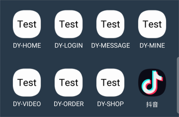

# 详细介绍

我们先讲**模块间的架构**，然后再讲**模块内的架构**，最后讲**使用**。

## 模块间架构

在不断变大的代码库中，**可扩缩性**、**可读性**和**整体代码质量**通常会随着时间的推移而降低。这是因为代码库在不断变大，而其维护者未采取积极措施来保持易于维护的结构。**模块化**是一种行之有效的代码库构建方法，可帮助改善可维护性并避免此类问题。

> - **模块化**相关，请看官方的 [Android 应用模块化指南](https://developer.android.com/topic/modularization)。
>
> - **官方（标准版）模块划分demo**相关，请看官方的[nowinandroid](https://github.com/android/nowinandroid)。

### 模块划分

#### 标准版

本项目**官方（标准版）**的**模块化**完成后，**模块图（部分模块）** 如下：

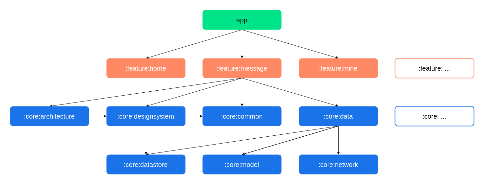

**模块说明：**

* `app`**模块**：`app`模块依赖于**所有**的`feature`模块和**必需**的`core`模块。
* `feature:`**模块**：`feature`模块**不应该依赖于其它的**`feature`模块，它们只依赖于**所需**的`core`模块。
* `core:`**模块**：`core`模块**可以依赖于其它的**`core`模块，但**它们不应该依赖于**`feature`模块或`app`模块。

本项目**官方**的**模块化**完成后，项目**目录图**如下（**标准版**）：

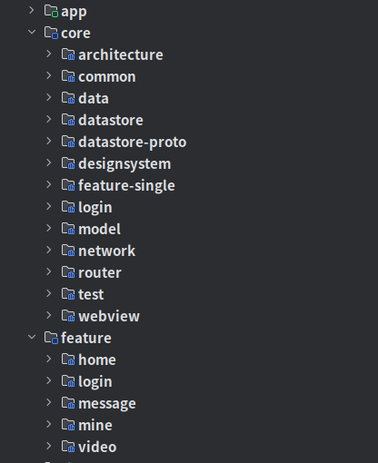

#### 多App版

**一般一个公司并非一个App**，比如**商城功能App**（一个用户端、一个商家端）、**外卖功能App**（一个用户端、一个骑手端）。以**字节跳动**公司为例子，其中公司开发的App有**抖音**、**西瓜视频**、**今日头条**、**飞书**、**剪映**等。 

上面**官方（标准版）**的**模块**划分，导致内部的`core`模块含有**本App特有**的、**所有App通用**的代码及资源，仅适用于**单App**架构。如果要适用**多App**架构，就需要把`core`模块内**所有App通用部分**提取出来，提取后的项目，项目**目录图**如下（**多App版**）：

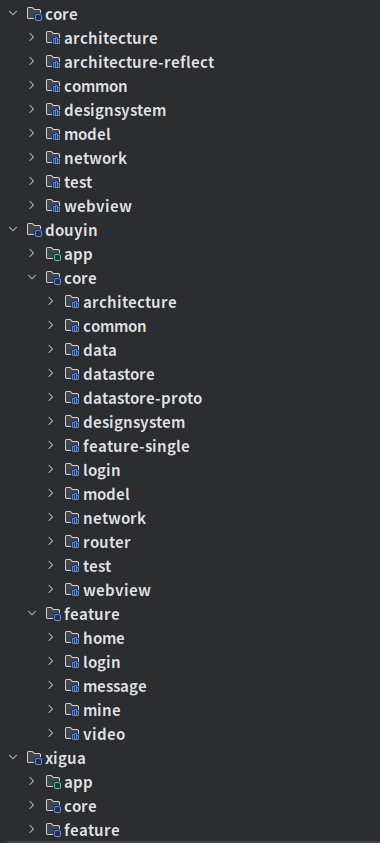

> 变化说明：
>
> 1. 把**标准版**的**抖音**的模块结构，存到了**最外层**`douyin`**目录**。
> 2. 把一些**可所有App共用**的模块，存到了**最外层**`core`**目录**。
> 3. 把**标准版**的**西瓜视频**的模块结构，存到了**最外层**`xigua`**目录**。

**目录说明：**

* **最外层**`core`**目录**：为**所有App**都可以使用的代码及资源，**内部模块**被**所有App**内的`core`**模块**依赖。
* **最外层**`douyin`**目录**：为**抖音App自己独有（特有）**的相关代码及资源。
  * `core`**模块**：依赖**最外层**`core`**目录**内的模块，**反之不行**。
  * `app`**模块**、`feature`**模块**：直接依赖**抖音内部**`core`模块即可，此为**最外层**`core`**目录**的**功能定制**，如：直接依赖**抖音App**的`:douyin:core:architecture`模块即可，此模块为**抖音App**对`:core:architecture`模块（**所有App通用的-架构模块**）的**定制**。
* **最外层**`xigua`**目录**：为**西瓜视频App**的相关代码，规则同上（抖音）。


> 说明：还可以在**最外层**继续开发其它App，如**今日头条**、**飞书**、**剪映**等，规则同上（抖音、西瓜视频）。


#### 可移除版

在项目开发过程中，如果你**不看好**要开发的功能，或者领导、产品告诉你，要开发的功能**之后可能会移除**，你可以使用此设计。

以**抖音App**为例，**最早**的**抖音**是没有**商城**功能的，如果以**商城**功能之后会**移除**来开发，你可以使用以下模块设计。

现在的项目，项目**目录图**如下（**可移除版**）：

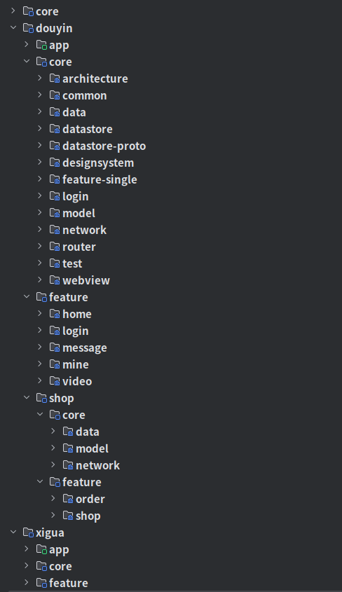

> 变化说明：
>
> 1. 把**可能要移除的shop功能**的模块结构，存到了**最外层**`douyin`**目录**。

**新增的shop目录说明：**

* `core`**模块**：**可以依赖抖音、商城core模块，但是抖音core模块不能依赖商城core模块（以便好在抖音内移除）**。
* `feature`**模块**：**同级feature间不能相互依赖，只能依赖抖音、商城core模块**。

可以**修改项目根目录**下`gradle.properties`内`isShopInclude`为`false`、`isRouterReflect`为`true`，来演示此**移除功能**。

```groovy
isShopInclude = false
isRouterReflect = true
```

> 说明：
>
> `isShopInclude`：为是否**包括商城**。
>
> `isRouterReflect`：为是否`Router`**反射实现**。 
>
> - 本项目`Router`的实现分为了两种，**Dagger实现**（**正式**用）、**反射实现**（**测试**用），详细看`router`模块。

### 模块包名

包名格式一般为：**域名反转+项目名+功能名**，以此**字节跳动**（域名：www.bytedance.com ）公司**抖音**项目为例，规则如下：

* `core`：**com.bytedance.core.xxx**（**和特定App无关**），如：com.bytedance.core.architecture
* `douyin`：com.bytedance.**douyin.xxx**（**和特定App有关**）
  * `app`：com.bytedance.**douyin**
  * `core`：com.bytedance.**douyin.core**.xxx，如：com.bytedance.douyin.core.architecture
  * `feature`：com.bytedance.**douyin.feature**.xxx，如：com.bytedance.douyin.feature.home
  * `shop`：com.bytedance.**douyin.shop**.xxx
    * `core`：com.bytedance.**douyin.shop.core**.xxx，如：com.bytedance.douyin.shop.core.data
    * `feature`：com.bytedance.**douyin.shop.feature**.xxx，如：com.bytedance.douyin.shop.feature.shop
* `xigua`：规则同上（抖音）


### 模块功能

* `app`：项目的入口，含有`MainActivity`、`Application`等。
* `core`
  * `architecture`：架构相关，包含一些基础类，如：最外层`:core:architecture`模块包含通用的`BaseViewsActivity`、`BaseViewsFragment`等，抖音层`:douyin:core:architecture`模块包含**抖音**定制的`AppViewsActivity`、`AppViewsFragment`等。
  * `architecture-reflect`：架构反射实现相关，包含一些架构内的反射实现，如：`reflectInflateViewBinding`（反射实现`ViewBinding`）、`reflectViewModels`（反射实现`ViewModel`）。
  * `common`：通用相关，包含一些通用类、工具类等。
  * `designsystem`：设计系统相关，包含控件、主题等。
  * `model`：`Model`类相关，包含`Model`类等。
  * `network`：网络相关，包含`NetworkDataSource`、网络工具类、图片加载等。
  * `test`：测试页面相关（为了给未实现的功能，占位用），包含`TestActivity`、`TestFragment`等。
  * `webview`：网页相关，包含网页的跳转、配置等。
  * `data`：数据相关，包含`Repository`类等。
  * `datastore`：`DataStore`存储相关，包含`PreferencesDataSource`等。
  * `datastore-proto`：`DataStore`的`proto`配置相关，包含`user.proto`配置等。
  * `feature-single`：单独模块运行通用配置相关，包含`TestFragmentDetailsAndroidEntryPointActivity`等。
  * `login`：登录相关，包含登录检测、当前登录状态、退出登录等。
  * `router`：路由系统相关，包含`Router`的**Dagger实现**、**反射实现**等。
* `feature`：功能业务，包含UI、`ViewModel`等。


### Feature模块间通信介绍

`Feature`模块间通信，使用`router`模块的`Router`类进行通信，以`home`模块为例规则如下：

#### 定义

```kotlin
interface HomeRouter {
    fun createHomeFragment(): Fragment
}
```

此`HomeRouter`接口为`home`模块**对外暴露**的**可供其它模块调用**部分，在`router`模块内定义，如果还有其它的，可继续在此接口内添加，如：`createXXXFragment`、`startXXXActivity`方法等。

#### 真的实现

```kotlin
class DefaultHomeRouter : HomeRouter {
    override fun createHomeFragment(): Fragment = HomeFragment.newInstance()
}
```

此`DefaultHomeRouter`类为`HomeRouter`接口**真的实现**，在`home`模块内实现。

#### 假的实现

```kotlin
class FakeHomeRouter : HomeRouter {
    override fun createHomeFragment(): Fragment = AppTestFragment.newInstance("Home")
}
```

此`FakeHomeRouter`类为`HomeRouter`接口**假的实现**，在`router`模块的`router-reflect`内实现，内部使用的`AppTestFragment`仅是**为了显示时占位用**。

> 说明：
>
> **Router-Dagger实现**：使用`Dagger`找`HomeRouter`的实现（目前提供的是`DefaultHomeRouter`），如果找不到**会报错**。
>
> **Router-反射实现**：使用**反射**直接找`DefaultHomeRouter`，如果找不到会直接使用`FakeHomeRouter`，**不会报错**。

#### 调用

```kotlin
val homeFragment = Router.Home.createHomeFragment()
```


### 单独运行Feature模块介绍

如果你只负责某个`Feature`模块，或者想**更解耦**、**更快**的测试你的功能，你可以使用此**单独运行Feature模块**，步骤如下：

#### 修改配置

修改**项目根目录**下`gradle.properties`内`isFeatureSingle`为`true`，并`Sync`同步`Gradle`。

```groovy
isFeatureSingle = true
```

> 说明：
>
> `isFeatureSingle`：为是否**单独运行Feature模块**。如果**开启**，则`Router`使用**反射实现**，以使其调用**其它模块**没有时**不会报错**，而是使用`Fake`的实现（如：占位显示）。

#### 添加测试入口点

此功能需要配合使用我的[TestPoint](https://github.com/zrq1060/TestPoint)库来实现，添加**测试入口点**，即会在**测试列表页**增加一个按钮，点击按钮跳转到此`Activity`、`Fragment`，**定制按钮点击**等详细使用请看[TestPoint](https://github.com/zrq1060/TestPoint)。

在目标类上添加`TestEntryPoint`注解，如`ShopFragment`：

```kotlin
@TestEntryPoint("商城")
class ShopFragment{

}
```

#### 运行

**单个运行：**

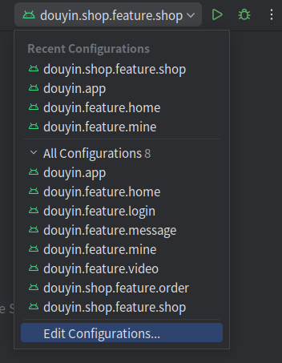

选择上面的一个，并运行，如：选择`douyin.shop.feature.shop`，则**运行抖音的商城功能**（可以测试**商城的点击Item**功能等）。

**多个运行：**

点击右侧`Gradle`-`Tasks`-`install`-`installDebug`，**或**执行如下命令：

```groovy
.\gradlew installDebug
```

执行完后，会在**手机桌面**出现**所有Feature模块**的`App`（如快速介绍-单独运行Feature模块演示图所示），**点击**某个即可测试某单个**Feature**模块。


## 模块内架构

### 官方架构

模块内架构，使用**官方**的[推荐架构](https://developer.android.com/topic/architecture#recommended-app-arch)，有助于构建强大而优质的应用。

> **应用架构**相关，请看官方的 [应用架构指南](https://developer.android.com/topic/architecture)。

官方的**架构概述图** 如下：

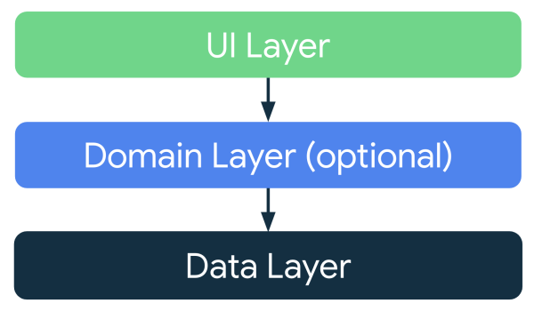


官方架构分为了：**UI层**、**Domain层**（可选）、**Data数据层**。

### 项目架构

本项目，目前**没有使用**`Domain`层，也**没有使用**`Room`库，目前的项目**架构图** 如下：

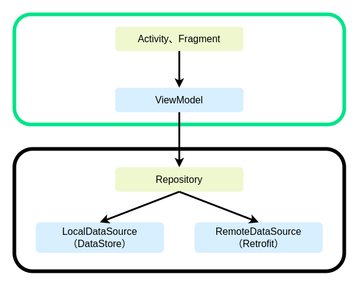


# 使用

## Activity、Fragment

以`demo`模块的`MainActivity`为例：

```kotlin
package com.bytedance.demo.app.main

import android.view.LayoutInflater
import androidx.activity.viewModels
import com.bytedance.douyin.core.architecture.app.views.AppViewsActivity
import dagger.hilt.android.AndroidEntryPoint
// 设置as别名，一般都是设置这几个。
// 使用别名后，此类的模板，下面的不需要改了，只需要改上面as这里即可。
import com.bytedance.demo.app.main.MainUiState as UiState
import com.bytedance.demo.app.main.MainViewModel as ViewModel
import com.bytedance.demo.databinding.ActivityMainBinding as ViewBinding

/**
 * 描述：
 *
 * @author zhangrq
 * createTime 2025/3/24 11:14
 */
@AndroidEntryPoint
class MainActivity : AppViewsActivity<ViewBinding, UiState, ViewModel>() {
    // 在父类AppViewsActivity中，可用反射实现（reflectViewModels()），省略此实现。
    override val viewModel: ViewModel by viewModels()

    // 在父类AppViewsActivity中，可用反射实现（reflectInflateViewBinding()），省略此实现。
    override fun inflateViewBinding(inflater: LayoutInflater) = ViewBinding.inflate(inflater)

    // 初始化View（可以在里面直接拿到当前页面布局控件）
    override fun ViewBinding.initViews() {
        // 设置TextView控件
        content.textSize = 50f
//        content.setTextColor(Color.BLACK)
    }

    // 初始化Listener（可以在里面直接拿到当前页面布局控件）
    override fun ViewBinding.initListeners() {
        // 设置TextView点击
        content.setOnClickListener {
            // 显示Toast，此Toast和当前页面的生命周期绑定，当前页面不可见，Toast关闭。
            viewModel.showMessage("Long Toast", isShort = false)
        }
    }

    // 初始化Observer（可以在里面直接拿到当前页面布局控件），用于观察（收集）ViewModel内的暴露的属性值（Flow值）。
    override fun ViewBinding.initObservers() {
    }

    // 收集UiState的值（可以在里面直接拿到当前页面布局控件），用于设置当前页面的数据。
    override fun ViewBinding.onUiStateCollect(uiState: UiState) {
        // 设置TextView的值
        content.text = uiState.tabs?.joinToString()
    }
}
```

> `Activity`、`Fragment`、`DialogFragment`的**使用规则相同**，以`Activity`为例，说明如下：
>
> 1. `MainActivity`直接继承**App级**的`AppViewsActivity`，此类为**抖音**项目对**通用级**的`BaseViewsActivity`的**定制**。
> 2. `ViewModel`、`ViewBinding`的**创建**，由于本项目**为了性能没有使用反射**，所以需要在**每个子类中自己实现**，可以在**App级**的`AppViewsActivity`内使用`reflectInflateViewBinding`、`reflectViewModels`**反射实现**，这样就**可以在每个子类**中省略`ViewModel`、`ViewBinding`的**创建代码**。
> 3. **初始化系列方法**，使用`ViewBinding`扩展方法，是为了能让其**在方法内直接获取到**`xxx`**控件**，而不用通过`binding.xxx`获取，以**更方便**的**操作控件**。
> 4. `XXXBinding`、`XXXUiState`、`XXXViewModel`，全部通过**as别名**来命名，**简化了名字长度**，**统一了代码样式一致性**，这样**新类**只需要**修改模板类上面as别名**即可。


## ViewModel

以`demo`模块的`MainViewModel`为例：

```kotlin
package com.bytedance.demo.app.main

import com.bytedance.douyin.core.architecture.app.AppViewModel
import com.bytedance.douyin.core.data.repository.interfaces.MainRepository
import com.bytedance.douyin.core.model.MainTabType
import dagger.hilt.android.lifecycle.HiltViewModel
import kotlinx.coroutines.flow.Flow
import kotlinx.coroutines.flow.map
import javax.inject.Inject
// 设置as别名
import com.bytedance.demo.app.main.MainUiState as UiState

/**
 * 描述：
 *
 * @author zhangrq
 * createTime 2025/3/24 11:14
 */
@HiltViewModel
class MainViewModel @Inject constructor(mainRepository: MainRepository) : AppViewModel<UiState>() {

    override val uiStateInitialValue: UiState = UiState() // UiState-初始化值

    // 从MainRepository获取的本地流，本地数据改，UI改。
    override val uiStateFlow: Flow<UiState> = mainRepository.getMainTabsStream().map {
        // UiState-页面值
        UiState(tabs = it)
    }
}

// Main-UiState
data class MainUiState(
    val tabs: List<MainTabType>? = null,
)
```

> 说明：
>
> 1. `ViewModel`直接继承**App级**的`AppViewModel`，此类为**抖音**项目对**通用级**的`BaseViewModel`的**定制**。
> 2. `uiStateInitialValue`为`UiState`的初始化值，一般为**默认的**`UiState`**对象**。
> 3. `uiStateFlow`为`UiState`的`Flow`流，它变化会影响到`Activity`、`Fragment`的`onUiStateCollect()`，一般为`Flow`（**单个**`Flow`、使用`combine()`观察**多个**`Flow`）的`map()`转为`UiState`的`Flow`。
> 4. `XXXUiState`，通过**as别名**来命名，**简化了名字长度**，**统一了代码样式一致性**，这样**新类**只需要**修改模板类上面as别名**即可。


## 生命周期Toast、Snackbar

**直接显示**`Toast`、`Snackbar`，是没有**生命周期控制**的（**只负责显示**），即使`Activiy`、`Fragment`**不可见**（被销毁、回到后台），**也还在显示**。我增加了**生命周期消息显示**，仅在`Activiy`、`Fragment`**可见时显示**。

### 指定消息的显示

**指定消息的显示**，是使用`Toast`，还是`Snackbar`，目前**默认**为`Toast`。

- **全局消息指定**，在`BaseGlobalMessageInitializer`类设置。
- **生命周期消息指定**，在`App`级的`AppViewsActivity`、`AppViewsFragment`、`AppViewsDialogFragment`**重写**`messageCollector`的实现。

### 使用消息

```kotlin
// 全局消息，不受Activiy、Fragment的生命周期影响。
MessageManager.showGlobalMessage("Global Message")
// 生命周期消息，受viewModel的Activiy、Fragment的生命周期影响。
viewModel.showMessage("Short Message")
viewModel.showMessage("Long Message", isShort = false)
```


## StateView

`StateView`为**包含多个状态形式View**的接口，状态包括：`Loading`、`Error`、`Empty`、`Success`。

### 定制UI

**定制UI**：目前实现`StateView`接口的类是`DefaultStateView`。

- **小改**：`DefaultStateView`，**默认**实现了`Loading`、`Error`、`Empty`**状态**的`View`，可**修改指定某个**来**定制UI**。
- **大改**：可通过修改`createAppStateView()`、`createAppListStateView()`方法，返回`StateView`**接口的其它实现类**。

### 原理

- **列表使用**：是使用[BaseRecyclerViewAdapterHelper](https://github.com/CymChad/BaseRecyclerViewAdapterHelper)的`stateView`实现，底层原理是**给RecyclerView的Adapter添加了一条Item布局**。**Empty状态**，是通过**返回的列表数据是否为空**来判断的，详细使用看`BaseRefreshLoadMoreHelper`。
- **普通使用**：是使用**Base类**`Activity`、`Fragment`的`getStateViewReplaceView()`方法实现，底层原理是**给此方法返回的View替换显示为StateView**。**Empty状态**，**目前未判断**，如需修改请看`BaseViewModel.requestAsyncBase()`扩展方法。

### 使用

- **列表使用**：**已封装好**，目前已支持[SmartRefreshLayout](https://github.com/scwang90/SmartRefreshLayout)、[SwipeRefreshLayout](https://developer.android.com/jetpack/androidx/releases/swiperefreshlayout)两个控件，详细使用请看`SmartRefreshLoadMoreHelper`、`SwipeRefreshLoadMoreHelper`。
- **普通使用**：需要使用`BaseViewModel.requestAsyncBase()`扩展方法**定制**。
  - **配置**：`Activity`、`Fragment`需要实现`getStateViewReplaceView()`，此为`StateView`要**替换的View**（用于实现**替换显示StateView**时，**隐藏此View**），可通过**覆写**此方法来**修改StateView的显示范围**，如果不覆写**默认**为此`Activity`、`Fragment`的`root`**根布局**。详细使用，请看**通用级**的`BaseViewsActivity`、`BaseViewsFragment`等。
  - **使用**：**请求异步**的**UI**每人的需求不同（如：`Error`状态，有人想要显示`Error`**重试布局**，有人想要只需要**消息提示**），**定制**详细使用，请看`BaseViewModel.requestAsyncBase()`扩展方法。

## 刷新、自动加载

### 原理

- **刷新**：是使用[SmartRefreshLayout](https://github.com/scwang90/SmartRefreshLayout)或[SwipeRefreshLayout](https://developer.android.com/jetpack/androidx/releases/swiperefreshlayout)实现。
- **自动加载**：是使用[BaseRecyclerViewAdapterHelper](https://github.com/CymChad/BaseRecyclerViewAdapterHelper)的`setTrailingLoadStateAdapter()`实现，底层原理是**通过**`ConcatAdapter.addAdapter(adapter)`**增加了尾Adapter**，详细使用请看`BaseRefreshLoadMoreHelper`。

### 使用

1. **UI层**：`Activity`、`Fragment`实现类，需要使用`SmartRefreshLoadMoreHelper`或`SwipeRefreshLoadMoreHelper`初始化，详细看**ShopFragment**。
2. **ViewModel层**：`ViewModel`实现类，需要实现`RefreshRepositoryOwner`接口，其`onRefreshRepository()`方法需要返回**刷新/刷新加载**仓库。
3. **Repository层**：
   1. `Repository`实现类，需要**实现**`RefreshRepository`（**仅刷新**）或`RefreshLoadMoreRepository`（**刷新加载**）接口。
   2. `Repository`实现类，需要**继承**`PageKeyedMemoryRefreshLoadMoreRepository`（**通过page加载**）或`ItemKeyedMemoryRefreshLoadMoreRepository`（**通过Item加载**）类。


## 网络

一个公司，可能有**多个网络规则**，可创建实现`BaseNetworkModel`接口的**XXXBaseNetworkModel**类，来实现**此规则定制**功能，后续只需使用此类即可。目前项目内有**2个规则**案例，请看`ApiOpenBaseNetworkModel`、`AppBaseNetworkModel`类。

### 定义XXXBaseNetworkModel

以开源接口[ApiOpen](https://api.apiopen.top/swagger/index.html)为例，其返回格式模板为：

```json
{"code": 200,  "message": "成功!",  "result": "string"}
```

`code`为**200代表公司的规则成功**，`message`为**提示的消息**，`result`为**结果（类型任意）**，以此创建类如下：

```kotlin
@Serializable
data class ApiOpenBaseNetworkModel<T>(val code: Int, val message: String, val result: T? = null) :
    BaseNetworkModel<T> {
    override fun isRuleSuccess() = code == 200

    override fun code() = code
    override fun message() = message
    override fun data() = result
}
```

### 使用XXXBaseNetworkModel

```kotlin
interface FakeNetworkLoginApi {
    /**
     * 登录
     */
    @POST("api/login")
    @FormUrlEncoded
    suspend fun login(
        @Field("account") account: String,
        @Field("password") password: String,
    ): ApiOpenBaseNetworkModel<FakeNetworkUser>
}
```

`login()`方法，其返回值为`ApiOpenBaseNetworkModel`，其**泛型为json模板的result值**。调用如下：

```kotlin
loginApi.login(account, password)
```

`loginApi.login()`方法，其返回值为`ApiOpenBaseNetworkModel`，这个数据不仅包含了**json模块的全部信息**，而且我们还得需要判断其**是否公司规则成功**。

可以使用以下**转换方法**，转为自己想要的结果。

### 转换XXXBaseNetworkModel

```kotlin
loginApi.login(account, password).toRuleSuccessData()
```

`toRuleSuccessData()`方法，将`ApiOpenBaseNetworkModel`，转换为**公司规则成功**，并且**返回其内部的result**，并且**此返回值不为空**。

**目前支持的，所有转换方法，如下：**

```kotlin
/**
 * 网络成功-规则成功-内部数据-不可空
 */
fun <T> BaseNetworkModel<T>.toRuleSuccessData(): T {
    if (!isRuleSuccess()) {
        throw RuleException(code(), message())
    }
    return data()!!
}

/**
 * 网络成功-规则成功-内部数据-可空
 */
fun <T> BaseNetworkModel<T>.toRuleSuccessDataNullable(): T? {
    if (!isRuleSuccess()) {
        throw RuleException(code(), message())
    }
    return data()
}

/**
 * 网络成功-规则成功-全部数据
 */
fun <T> BaseNetworkModel<T>.toRuleSuccess(): BaseNetworkModel<T> {
    if (!isRuleSuccess()) {
        throw RuleException(code(), message())
    }
    return this
}
// 网络成功-全部数据。则不需要调用此转换方法，直接返回即可。
```

可根据自己的需求，使用自己想要的转换方法，一般为`toRuleSuccessData()`（**网络成功-规则成功-内部数据-不可空**）。

# 未来支持

- 支持**Compose**
- 优化**是否Login**相关逻辑
- 优化**WebView**相关逻辑

# 其它

## 三方库

### 自己

- [TestPoint](https://github.com/zrq1060/TestPoint)
- [SpanBuilder](https://github.com/zrq1060/SpanBuilder)

### 三方

- [Retrofit](https://github.com/square/retrofit)
- [Glide](https://github.com/bumptech/glide)
- [BaseRecyclerViewAdapterHelper](https://github.com/CymChad/BaseRecyclerViewAdapterHelper)
- [SmartRefreshLayout](https://github.com/scwang90/SmartRefreshLayout)
- [MagicIndicator](https://github.com/hackware1993/MagicIndicator)

## 参考

- [nowinandroid](https://github.com/android/nowinandroid)
- [architecture-samples](https://github.com/android/architecture-samples)

 

**欢迎大家点赞、收藏，以方便您后续查看。**

